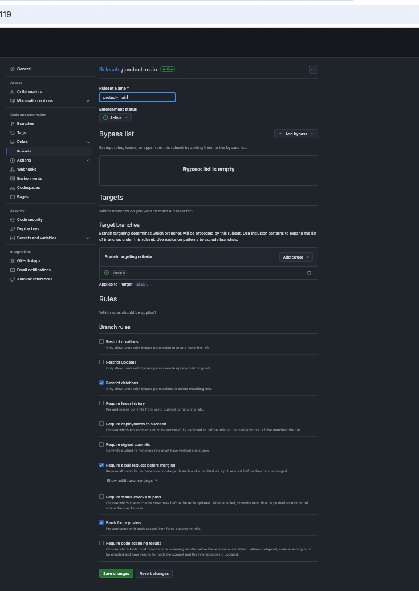
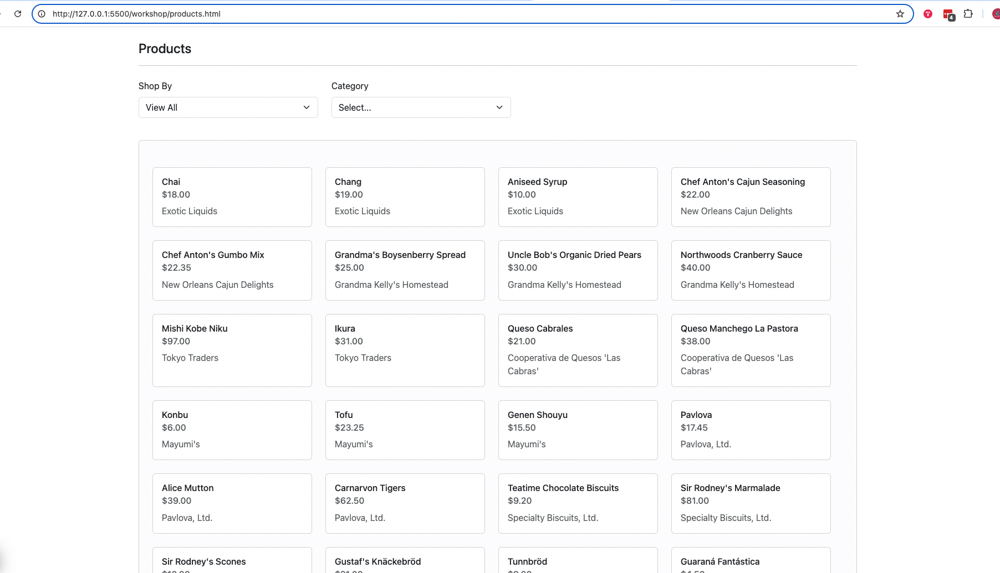
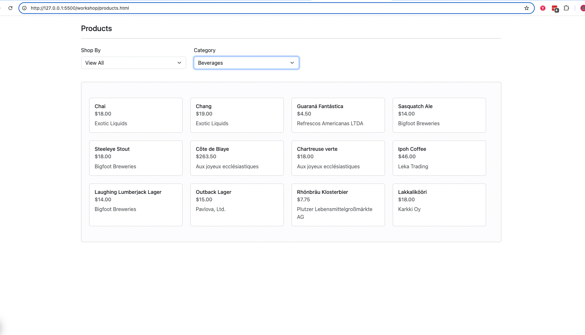

# Shop at Northwind

- Brightspace Week 9: Workbook 8 - Stay Organized Workshop v6.0Y.pdf
- pdf includes directions on setting up API and available endpoints at the end
- API is already setup on your computer at `learntocode\northwind-workshop-express-server`

## API Setup

The [Backend API is in this repository](https://github.com/DevelopIntelligenceBoulder/northwind-workshop-express-server.git), but you should have it cloned (downloaded on your computer already)

1. Find `learntocode\northwind-workshop-express-server` in Windows Explorer or Finder (Mac)
2. Right click and choose `open git bash here` or `open terminal in folder` depending on operating system.
3. Run the command:
   ```
   npm start
   ```
4. Leave that terminal window up and running
   > For more information about Backend APIs such as stopping and pulling it down the [Backend API notes here](https://github.com/craigmckeachie/fall2024-workbook7/blob/main/backend-api.md)

## Calling an API

- [API Notes](https://github.com/craigmckeachie/fall2024-workbook7/blob/main/api-notes.md)
- [GET, POST, PUT, DELETE Notes](https://codewithcraig.netlify.app/reference/rest/)

## Setting up Git Collaboration

- [Git Collaboration Notes Landing Page](https://codewithcraig.netlify.app/git/git-collaboration/)
- [Adding Collaborators](https://codewithcraig.netlify.app/git/github-repository-configuration/)
- Main Branch Protection Rule
  
- [Git Collaboration Feature Branch Workflow Cheatsheet](https://codewithcraig.netlify.app/git/git-collaboration-cheatsheet/)
- [Git Collaboration Feature Branch Workflow Detailed](https://codewithcraig.netlify.app/git/git-feature-branch-workflow/)

## Screenshots





## Solution

- Mostly complete [solution code](https://github.com/craigmckeachie/fall2024-workbook7/tree/main/workshop).

